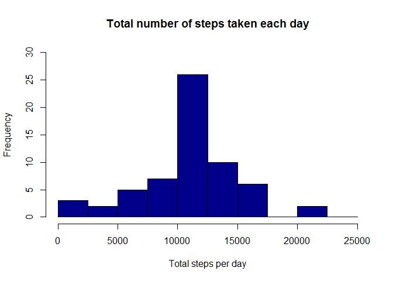
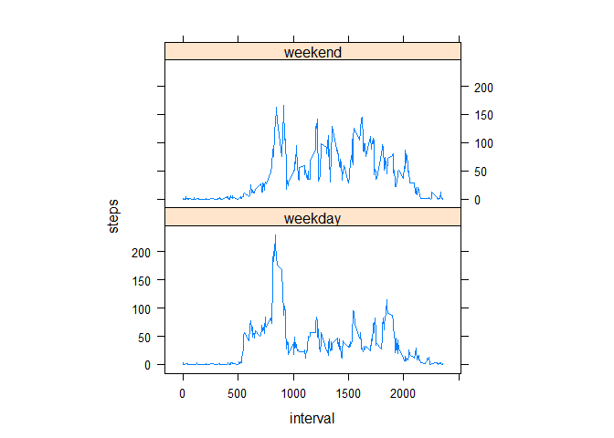

# Reproducible Research: Peer Assessment 1


## Loading and preprocessing the data

Loading the data
----------------

* Load the data

```r
activity = read.csv("activity.csv")
```
* Process/transform the data (if necessary) into a format suitable for your analysis

```r
totalSteps<-aggregate(steps~date,data=activity,sum,na.rm=TRUE)
```

##What is mean total number of steps taken per day?
-------------------------------------------------

* Make a histogram of the total number of steps taken each day

```r
hist(totalSteps$steps)
```

<!-- -->

* Here is the mean of the total number of steps taken per day


```r
mean(totalSteps$steps)
```

```
## [1] 10766.19
```

* The mean total number of steps taken per day is 
    1.0766189\times 10^{4} steps.
    
##What is the average daily activity pattern?
-------------------------------------------

* Make a time series plot (i.e. type = "l") of the 5-minute interval (x-axis) and the average number of steps taken, averaged across all days (y-axis)


```r
average_daily_activity<-aggregate(steps~interval,data=activity,mean,na.rm=TRUE)
plot(steps~interval,data=average_daily_activity,type="l")
```

<!-- -->

* Which 5-minute interval, on average across all the days in the dataset, contains the maximum number of steps? 

```r
average_daily_activity[which.max(average_daily_activity$steps),]$interval
```

```
## [1] 835
```


It is the **835th** interval.

##Imputing missing values
-----------------------

* There are a number of days/intervals where there are missing values (i.e. the total number of rows with NAs)


```r
sum(is.na(activity$steps))
```

```
## [1] 2304
```

Total 2304 rows are missing.

* For filling in all of the missing values in the dataset.
 

```r
intervalsteps<-function(interval){
    average_daily_activity[average_daily_activity$interval==interval,]$steps
}
```

* Create a new dataset that is equal to the original dataset but with the missing data filled in.


```r
activityFilled<-activity 
count=0          
for(i in 1:nrow(activityFilled)){
    if(is.na(activityFilled[i,]$steps)){
        activityFilled[i,]$steps<-intervalsteps(activityFilled[i,]$interval)
        count=count+1
    }
}
cat("Total ",count, "NA values were filled.\n\r")  
```

```
## Total  2304 NA values were filled.
## 
```
* Make a histogram of the total number of steps taken each day and Calculate and report the mean and median total number of steps taken per day. 

```r
total_steps_imputed<-aggregate(steps~date,data=activityFilled,sum)
hist(total_steps_imputed$steps, col = "darkblue", xlab = "Total steps per day", ylim = c(0,30), main = "Total number of steps taken each day", breaks = seq(0,25000,by=2500))
```

<!-- -->

```r
mean(total_steps_imputed$steps)
```

```
## [1] 10766.19
```

```r
median(total_steps_imputed$steps)
```

```
## [1] 10766.19
```

* The mean total number of steps taken per day is 
1.0766189\times 10^{4} steps.
* The median total number of steps taken per day is 
1.0766189\times 10^{4} steps.


##Are there differences in activity patterns between weekdays and weekends?
---------------------------------------------------------------------------

* Create a new factor variable in the dataset with two levels weekday and weekend indicating whether a given date is a weekday or weekend day.

```r
activityFilled$day=ifelse(as.POSIXlt(as.Date(activityFilled$date))$wday%%6==0,
                          "weekend","weekday")
# For Sunday and Saturday : weekend, Other days : weekday 
activityFilled$day=factor(activityFilled$day,levels=c("weekday","weekend"))
```


* Make a panel plot containing a time series plot (i.e. type = "l") of the 5-minute interval (x-axis) and the average number of steps taken, averaged across all weekday days or weekend days (y-axis). The plot should look something like the following, which was creating using simulated data:

```r
stepsInterval=aggregate(steps~interval+day,activityFilled,mean)
library(lattice)
xyplot(steps~interval|factor(day),data=stepsInterval,aspect=1/2,type="l")
```

<!-- -->
